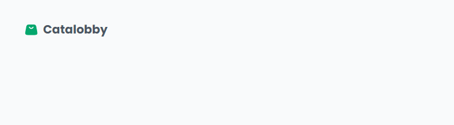

<h2 align="center">Catalobby</h1>

  

    <a href="#sobre-o-projeto">Sobre o projeto</a>
    <a href="#stacks-utilizadas">Stacks utilizadas</a>
        <a href="#rotas">Rotas</a>
    <a href="#instalação-e-execução-local">Instalação e execução local</a>
  

  <h2 align="center" id="sobre-o-projeto">Sobre o projeto</h2>

  

  ParaFacilitar o aluguel de uma variedade de itens para clientes que precisam temporariamente, proporcionando conveniência e economia. Desenvolvido com cuidado meticuloso para proporcionar uma experiência auto-intuitiva e envolvente.
  <h2>
 

Um software de aluguel online que funciona para todos os nichos de aluguel populares

  <h2 align="center" id="stacks-utilizadas">Stacks utilizadas</h2>

  

<h2 align="center">Progresso</h2>
<h3 align="center"  style="color: #00b8d9">
    10%
</h3>
